# Cara mendapatkan Linux Virtual Machine Gratis: Tutorial

Berikut adalah beberapa panduan singkat mengenai cara untuk mendapatkan akses terhadap sebuah Linux VM secara cuma-cuma. Panduan ini ditujukan untuk civitas Universitas Gadjah Mada, khususnya mahasiswa Departemen Teknik Geodesi UGM yang sedang menempuh mata kuliah SIG Berbasis Web maupun Infrastruktur Informasi Geospasial.

Panduan ini merupakan pengantar untuk materi praktikum lanjut mengenai SIG Berbasis Web dan Infrastruktur Informasi Geospasial. Setelah memperoleh satu *instance* Linux VM baik pada cloud maupun lokal, mahasiswa kemudian dapat menggunakannya untuk:

- Mempelajari perintah sederhana terkait Sistem Operasi Linux
- Berlatih menggunakan dan mengatur server berbasis Linux (DevOps)
- Melakukan *deployment* aplikasi berbasis web, seperti Geoserver
- Menggunakan dan memahami cara kerja Version Control System (VCS) seperti Github dan Gitlab
- Melakukan instalasi dan mengatur aplikasi geoportal berikut seluruh *dependencies* yang terkait

Panduan ini mengasumsikan penggunaan Windows 10 sebagai sistem operasi yang digunakan oleh pembaca serta mesin dengan kemampuan pemrosesan 64-bit. Adapun untuk Distro Linux yang akan digunakan adalah Ubuntu LTS, yang meskipun saat ini tersedia versi 20.04, tetapi pada latihan ini akan digunakan versi 18.04, karena adanya beberapa dependencies yang belum tersedia untuk keperluan geospasial pada versi terbaru.


## Daftar Isi

[toc]

## Bagian 1: Linux VM Berbasis Cloud

Linux VM berbasis Cloud adalah layanan yang disediakan oleh penyedia (*cloud provider*) untuk memungkinkan pengguna mengakses sebuah Virtual Machine berbasis Linux yang dapat diakses melalui jaringan internet. Konsep Linux VM semacam ini serupa dengan VPS (Virtual Private Server) yang disediakan oleh layanan hosting.

Perlu dicatat bahwa akses gratis pada Virtual Machine ini:

- Hanya dapat diakses pada waktu tertentu, misalnya selama 1 atau 2 bulan
- Kemampuan umum server (seperti jumlah bandwith yang disediakan, RAM dan media penyimpanan) dibatasi
- Sebagian memerlukan informasi berupa kartu kredit atau kartu debit yang didukung untuk pembayaran internasional (misalnya [Jenius](https://www.jenius.com/))

Berikut adalah panduan untuk mengaktifkan Linux VM berbasis Cloud pada sejumlah *provider*.

### Amazon Lightsail

[AWS](https://aws.amazon.com/) merupakan *cloud provider* yang cukup populer dengan berbagai layanan yang beragam, mulai dari layanan penyimpanan (S3) sampai virtual machine (EC2). Belakangan, AWS meluncurkan layanan yang lebih mudah digunakan oleh pemula, yaitu [Amazon Lightsail](https://lightsail.aws.amazon.com/) (https://lightsail.aws.amazon.com/). Amazon Lightsail memudahkan pengguna untuk mengakses layanan cloud sesuai dengan pilihan yang dibutuhkan pengguna. Berikut adalah daftar harga untuk layanan Amazon Lightsail:


Pada gambar di atas, Tier paling kiri (VM seharga 3.5USD) dapat digunakan gratis selama satu bulan pertama pemakaian.

Berikut adalah langkah yang diperlukan untuk mengaktifkan Amazon Lightsail:

1. Buka https://aws.amazon.com/, kemudian lakukan pendaftaran akun baru menggunakan tombol berikut:

   

2. Masukkan informasi yang dibutuhkan, seperti alamat email dan nama pengguna

   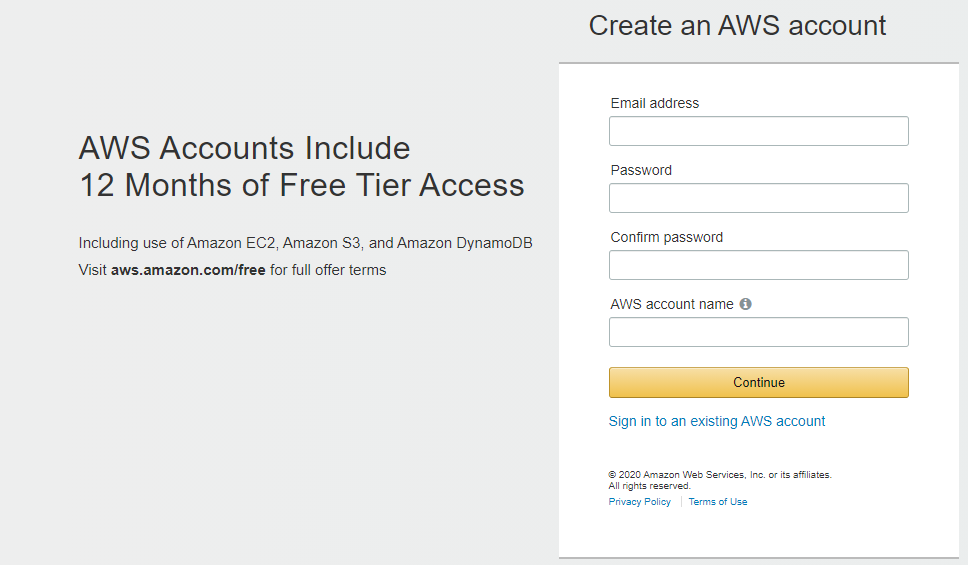

3. Agar layanan gratis dapat digunakan, terlebih dahulu masukkan informasi kartu debet pada bagian Billing > Payment Methods (https://console.aws.amazon.com/billing/home). Informasi ini hanya digunakan untuk mengaktifkan akun dan tidak akan dipungut biaya selama layanan yang digunakan masih dalam kuota *free tier*

   

4. Masukkan informasi kartu, termasuk CVC:

   

5. Setelah kartu didaftarkan, maka kartu ini dapat digunakan sebagai alat pembayaran pada AWS, sekiranya kelak akan digunakan layanan berbayar

   

6. Selanjutnya adalah mengaktifkan layanan Lightsail pada https://lightsail.aws.amazon.com/. Klik pada tombol `Create Instance` untuk membuat mesin baru

   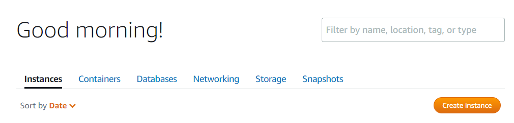

   

7. Ikuti langkah yang tersedia untuk membuat sebuah instance Linux baru. Gunakan OS Ubuntu versi 20.04 atau 18.04 (`OS Only`). Keduanya merupakan versi LTS pada saat panduan ini ditulis. Untuk *Instance Location*, pilih lokasi terdekat, yaitu Singapore

   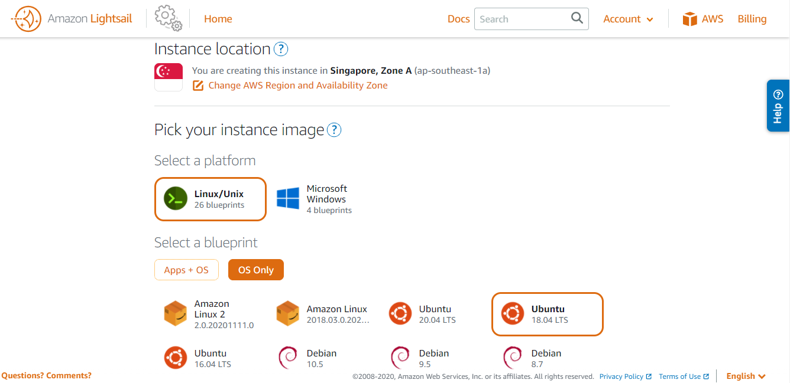 

8. Pada bagian bawah dari halaman yang sama, pilih instance yang akan digunakan. Semakin tinggi spesifikasi server yang diinginkan, maka akan semakin mahal biaya yang harus dibayarkan tiap bulan.

   

   Untuk keperluan deployment WebGIS atau sekedar berlatih melakukan instalasi perangkat geoportal, instance pertama dengan RAM 512 MB, 1 CPU dan 20GB SSD merupakan batas minimal. Penggunaan instance ini gratis untuk bulan pertama. 

   > **Catatan:**
   >
   > Untuk menghindari tagihan pada saldo kartu debet di bulan berikutnya, hapus instance yang dibuat ini sebelum berakhir bulan pertama (*atau kosongkan saldo pada e-card Jenius yang digunakan untuk mendaftar*)

9. Terakhir, beri nama pada Instance yang akan dibuat untuk membedakan mesin ini dengan mesin lain yang (mungkin) akan dibuat di masa yang akan datang. Klik pada `Create Instance` untuk membuat mesin ini.

   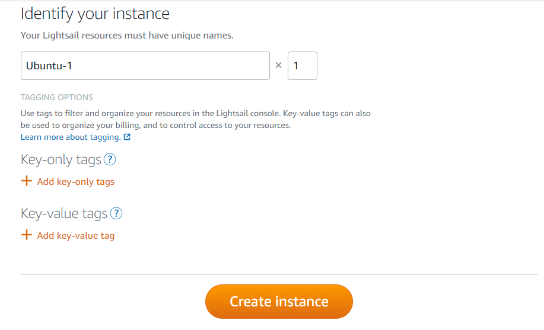

10. Selanjutnya mesin tersebut akan dibuat oleh AWS. Daftar mesin yang digunakan dapat dibuka pada halaman muka Amazon Lightsail

    

11. Klik pada nama mesin (`Ubuntu-HT` pada contoh di atas) untuk membuka halaman pengaturan instance:

    

12. Klik pada `Connect using SSH` pada menu di atas untuk melakukan koneksi ke server melalui browser

13. Mesin berbasis **Ubuntu Bionic** siap digunakan

    


### Azure Virtual Machine

[Azure Virtual Machine](https://portal.azure.com/) memiliki kuota gratis untuk pengguna yang bekerja sama dengan menggunakan layanan Microsoft Imagine. Untuk civitas UGM, ini berarti kuota sejumlah kurang-lebih 100USD yang dapat digunakan untuk mengaktifkan Azure VM.

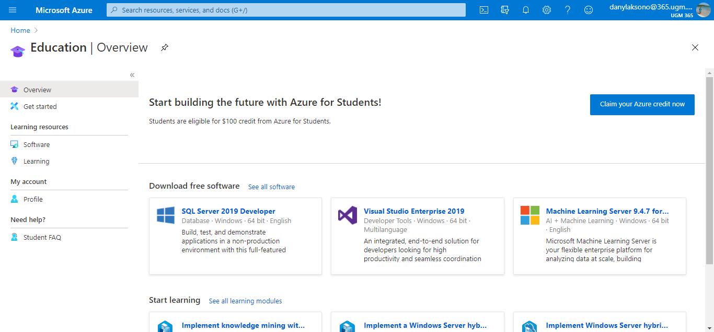

Berikut adalah langkah untuk mengaktifkan Azure VM:

1. Buka https://portal.azure.com/, kemudian login dengan menggunakan email Microsoft UGM (nama-mahasiswa@365.ugm.ac.id) dan password email UGM

2. Pada halaman yang muncul, klik Hamburger menu pada sebelah kiri untuk memunculkan daftar layanan yang dapat diakses. Klik pada Virtual Machines

   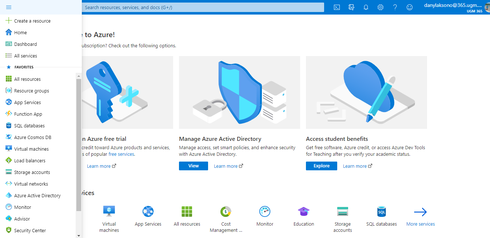

3. Klik `Add > Virtual Machine`

   

4. Muncul konfirmasi untuk menggunakan Free Account dengan batas waktu penggunaan 30 hari. 

   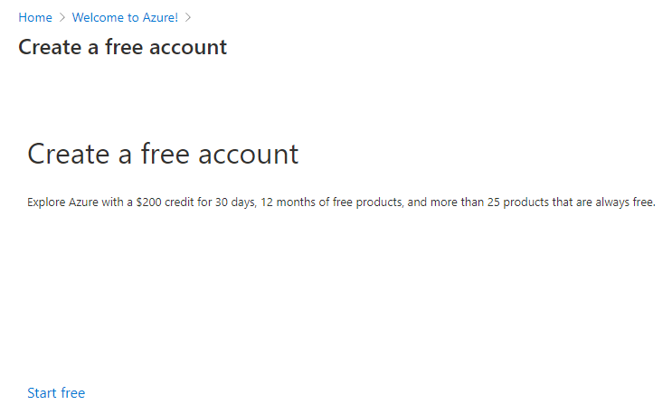

5. Klik pada Start Free, kemudian ikuti langkah selanjutnya sesuai petunjuk

   

Lanjutan panduan ini tidak dapat dibuat karena kuota yang telah tersedia untuk UGM telah digunakan, sehingga tidak dapat digunakan untuk membuat dan mengakses mesin virtual. Meskipun demikian, pembaca dapat mengacu pada tutorial yang banyak tersedia online, seperti [tutorial berikut](https://www.dicoding.com/blog/cara-membuat-virtual-machine-ubuntu-server-di-microsoft-azure/).


### Digital Ocean

Berbeda dengan penyedia layanan cloud lain, Digital Ocean hanya menyediakan kupon untuk tiap inisiasi Droplet (Virtual Machine pada Digital Ocean). Meskipun demikian, kuota gratis sebagai mahasiswa dapat diperoleh dengan menggunakan free student pack dari Github for Student:


Panduan untuk mengaktifkan kode promo ini dapat ditemukan pada https://www.digitalocean.com/community/questions/how-to-use-github-promo-code-student-developer-pack

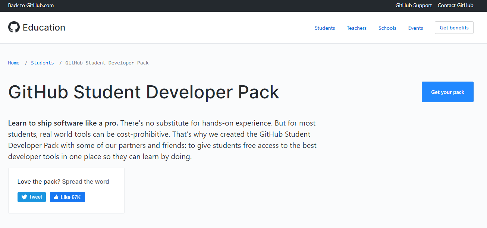

Setelah mengaktifkan kode promo, selanjutnya pembaca dapat mengacu pada berbagai tutorial yang tersedia mengenai cara membuat sebuah VPS dalam bentuk Droplet pada Digital Ocean, misalnya [tutorial berikut](https://musaamin.web.id/cara-membuat-vps-di-digitalocean/).


### Google Cloud Platform (GCP)

Google Cloud Platform memiliki layanan gratis untuk virtual machine yang kurang lebih sama seperti beberapa layanan yang disebutkan di atas. [Link berikut](https://cloud.google.com/compute/docs/instances) dapat digunakan sebagai acuan untuk memulai Virtual Machine berbasis Google Cloud Platform. Yang perlu diingat, layanan ini juga memerlukan informasi kartu debet atau kartu kredit, meskipun penggunaan bulan pertama sepenuhnya gratis, sebagaimana pada Amazon Lightsail.

Tutorial mengenai bagaimana memulai VPS pada GCP banyak tersedia di Internet. Misalnya, [tutorial berikut](http://www.newbienote.com/2020/09/cara-membuat-virtual-mesin-vps-di.html).


### Layanan VPS Lain

Selain berbagai layanan yang disebutkan di atas, terdapat banyak opsi untuk menggunakan layanan VPS berbayar yang disediakan oleh perusahaan-perusahaan lokal maupun internasional. Paket VPS ini cukup beragam sesuai dengan penawaran yang diberikan oleh tiap perusahaan. Berikut adalah contohnya:


Gambar di atas adalah paket VPS dari https://www.exabytes.co.id/server/vps-linux-ssd/paket#pricing. Perusahaan hosting lain di Indonesia yang menyediakan VPS dapat ditemukan dengan mudah menggunakan pencarian pada Search Engine dengan kata kunci, "VPS Murah" atau yang semisal.

## Bagian 2: Linux VM pada Komputer Desktop

Pada lingkungan lokal, Linux dapat dijalankan baik pada lingkungan virtual (Virtualization maupun Containerization) serta digunakan sebagai native installation (diinstall pada harddisk) maupun Live Boot dengan Linux Live. Beberapa opsi untuk menggunakan Linux pada lingkungan lokal di laptop atau PC dapat dilakukan sebagai berikut:

- Virtualisasi dengan menggunakan WSL2
- Virtualisasi dengan Vagrant (VirtualBox/VMWare)
- Live Boot dengan Linux Live

Pada bagian ini hanya akan dibahas lebih detil mengenai virtualisasi dengan WSL2. Untuk dua metode lain hanya akan diberikan pengantar dan link untuk dicoba.


### Virtualisasi dengan menggunakan WSL2

WSL2 (Windows Subsystem for Linux 2) merupakan integrasi mesin berbasis Linux pada Windows yang memungkinkan mesin Linux untuk dapat dijalankan pada Windows dengan performa maksimal. Indeks angka "2" menunjukkan bahwa virtualisasi ini adalah pengembangan lebih jauh dari mesin WSL yang pertama kali diusulkan oleh Microsoft pada tahun 2017. Perbedaan mencolok terlihat karena pada WSL2, mesin virtual yang dipasang menggunakan kernel linux yang sebenarnya. Artinya, performa yang dapat diperoleh dari mesin virtual ini juga sebaik mesin Linux yang sebenarnya. Selain itu, dengan menggunakan [Distro yang didukung oleh WSL2](https://ubuntu.com/wsl), akses Windows pada mesin (dan sebaliknya) dapat dilakukan secara hampir *seamless*.

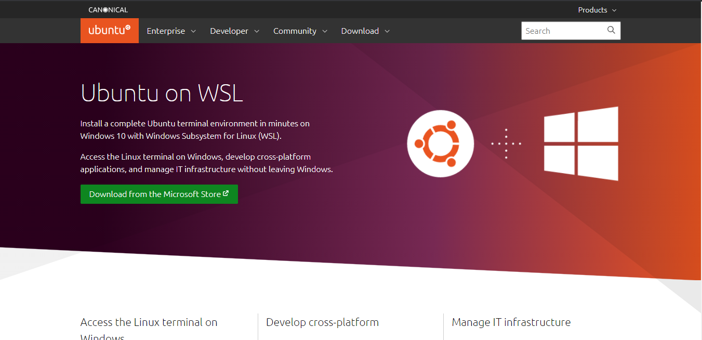

Untuk instalasi WSL2 ini, berikut adalah persyaratan yang harus dipenuhi:

- Windows 10 dengan versi update terbaru: Windows 10 May 2020 (2004), Windows 10 May 2019 (1903), or Windows 10 November 2019 (1909). Windows dengan versi update lama (1903 atau 1909) tetap dapat menginstall WSL2 dengan terlebih dahulu melakukan instalasi Windows Update [berikut ini](https://support.microsoft.com/en-us/help/4566116/windows-10-update-kb4566116)
- Komputer atau laptop yang memiliki dukungan **Hyper-V Virtualization**. Periksa [link berikut](https://www.zdnet.com/article/windows-10-tip-find-out-if-your-pc-can-run-hyper-v/) untuk mengetahui apakah Komputer atau laptop Anda memiliki dukungan Hyper-V.

Untuk melihat versi build Windows yang Anda gunakan, lakukan langkah berikut:

- Buka Windows Run (Win+R)

- Ketikkan `'winver'`

- Pada jendela yang muncul, akan terlihat versi build Windows yang sedang berjalan

  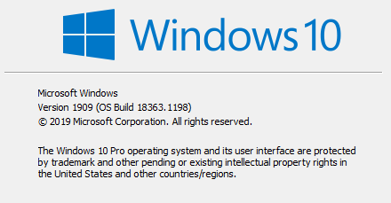
  
  
  
  Apabila versi build Windows Anda di bawah `18362`, maka terlebih dulu lakukan update Windows menggunakan [Update Assistant](https://www.microsoft.com/software-download/windows10).

> **Catatan:**
>
> Panduan ini dibuat dengan mengikuti panduan resmi di:
>
>  https://docs.microsoft.com/en-us/windows/wsl/install-win10
>
> Periksa tautan tersebut untuk melihat perubahan terbaru terkait dengan instalasi WSL


Berikut adalah petunjuk untuk melakukan instalasi WSL2 pada Sistem Operasi Windows 10:

1. *Mengaktifkan WSL melalui PowerShell*

   Buka `Windows PowerShell` sebagai Administrator.   

   

   Ketikkan perintah berikut pada command prompt yang tersedia:

   ```powershell
   dism.exe /online /enable-feature /featurename:Microsoft-Windows-Subsystem-Linux /all /norestart
   ```

   Akan muncul pemberitahuan apabila proses telah berhasil:

   

2. *Update ke WSL versi 2* 

   Pastikan versi build Windows yang digunakan sesuai untuk persyaratan WSL2 seperti di atas. Periksa [link berikut](https://docs.microsoft.com/en-us/windows/wsl/install-win10#step-2---update-to-wsl-2) untuk melihat lebih detil mengenai bagian ini.

3. *Aktifkan Virtual Machine Platform*

   Pada jendela PowerShell yang sama (sebagai Administrator), ketikkan perintah berikut:

   ```powershell
   dism.exe /online /enable-feature /featurename:VirtualMachinePlatform /all /norestart
   ```

   Setelah perintah selesai dijalankan, lakukan restart pada Windows. Ini akan mengupdate WSL pada system menjadi versi ke-2

4. *Unduh Linux kernel untuk WSL2*

   Terlebih dahulu unduh dan install Linux Kernel untuk WSL2 dari [Link Berikut](https://wslstorestorage.blob.core.windows.net/wslblob/wsl_update_x64.msi).

   Setelah instalasi berhasil, masukkan perintah berikut ke dalam PowerShell yang sama seperti sebelumnya:

   ```powershell
   wsl --set-default-version 2
   ```

   Ini akan membuat versi WSL yang telah terinstall menggunakan versi kedua.

5. *Melakukan Instalasi Distro Linux*

   Pada [Microsoft Store](https://aka.ms/wslstore) telah tersedia beberapa distro Linux yang dapat digunakan pada WSL. Buka Microsoft Store, kemudian lakukan instalasi untuk distro yang dipilih. Untuk latihan ini, gunakan `Ubuntu`, khususnya versi [Ubuntu 18.04](https://www.microsoft.com/store/apps/9N9TNGVNDL3Q).

   

   Klik `Get` untuk melakukan instalasi Ubuntu pada WSL2

   

6. *Memulai WSL*

   Setelah instalasi selesai, Ubuntu dapat langsung digunakan pada Windows. Untuk memulai WSL, buka icon menu bergambar logo Ubuntu (). 

   Pada saat pertama kali dibuka, mesin akan meminta **username** dan **password**. Catat username dan password yang dimasukkan karena ini akan menjadi akun *sudoer*  pada mesin Linux yang dibuat.

   

   Selanjutnya, Ubuntu siap digunakan

   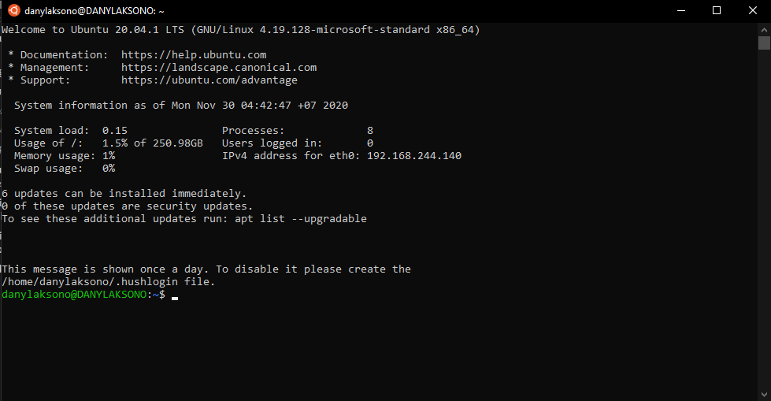

7. *Integrasi WSL dan Windows*

   Telah disampaikan sebelumnya bahwa integrasi Linux dan Windows menggunakan WSL2 bersifat hampir seamless. Artinya, kedua sistem dapat saling berkomunikasi tanpa memerlukan media perantara yang rumit.

   Untuk mengakses file WSL dari windows, buka Explorer, kemudian ketikkan pada bagian directory list: `\\wsl$`.

   

   Maka Windows akan membuka drive pada Linux sebagaimana sebuah folder biasa pada Explorer.

   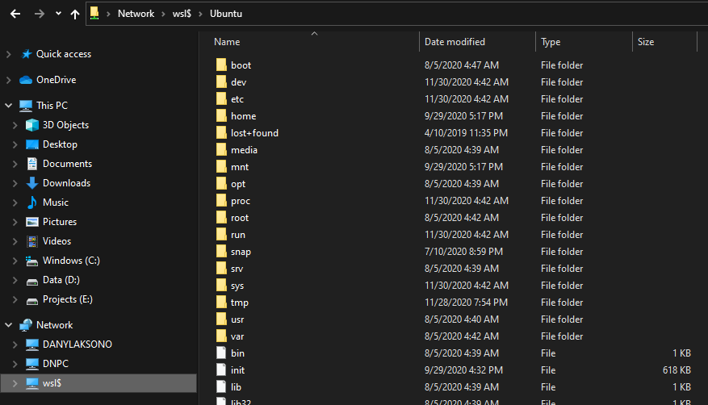

   Berkas yang disimpan pada 'folder' ini akan langsung terintegrasi dengan Linux tanpa perlu melakukan *rebooting*.

   Demikian pula, pada saat Ubuntu memanggil port tertentu, maka WSL akan secara otomatis melakukan *port forwarding*, sehingga port tersebut dapat dibuka pada Windows tanpa perlu melakukan langkah tambahan apapun.

   Sebagai contoh, berikut adalah pemanggilan Jupyter Lab dari konsol Ubuntu pada WSL2:

   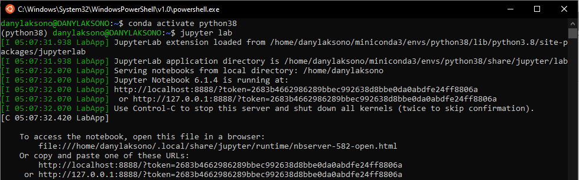

   Dan berikut adalah tampilan Jupyter Lab apabila dibuka pada browser di Windows:

   

8. *WSL2 untuk keperluan pembangunan aplikasi (development)*

   Untuk keperluan pembangunan aplikasi, WSL2 memungkinkan koneksi pada beberapa Code Editor. Sebagai contoh, VSCode memiliki dukungan untuk melakukan *editing* kode pada WSL2 melalui plugin. Klik [Link berikut](https://code.visualstudio.com/docs/remote/wsl) untuk detilnya.

   

   Berikut adalah contoh pemanggilan VSCode dari mesin Ubuntu:

   

   dan berikut adalah tampilan dari VSCode yang langsung terbuka dan terkoneksi dengan WSL2 tersebut:

   

   

Karena pengaturan *resource* untuk komputasi (memory, space harddisk) dilakukan [secara bersama-sama](https://www.digitalocean.com/community/posts/trying-the-new-wsl-2-its-fast-windows-subsystem-for-linux) oleh Windows dan WSL2 melalui Linux Kernel, maka penggunaan WSL tidak akan membebani sistem Windows. Dengan demikian, penggunaan Linux pada WSL2 ini adalah metode yang lebih disarankan daripada menggunakan Virtual Machine seperti VirtualBox atau VMWare yang dapat membebani kinerja sistem.


### Virtualisasi dengan Vagrant (Virtual Box/VMWare)

 merupakan perangkat yang membantu virtualisasi sistem operasi client (misalnya Linux) pada Host (misalnya Windows) sehingga dapat digunakan untuk keperluan pembangunan aplikasi (*development*). Vagrant membantu agar virtualisasi mesin Linux, misalnya, dapat dilakukan dengan cukup mudah di sistem Host seperti Windows tanpa perlu melakukan pengaturan yang cukup rumit. Sebagai contoh, berikut adalah cara untuk memulai sebuah mesin Vagrant setelah melakukan instalasi:

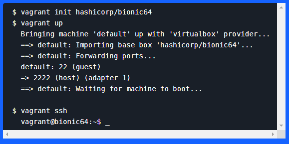

dan selanjutnya, mesin linux pada Windows akan dapat langsung digunakan.

Pada bagian ini, vagrant tidak akan dibahas dengan detil. Pembaca disarankan untuk mengacu pada berbagai tutorial mengenai Vagrant yang tersedia, contohnya:

- [Memulai Vagrant](https://mragus.com/mengenal-dan-belajar-apa-itu-vagrant/)
- [Vagrant, apa mengapa dan bagaimana](https://code.tutsplus.com/id/tutorials/vagrant-what-why-and-how--net-26500)


### Menggunakan Bootable Linux

Berbeda dengan kedua cara yang disebutkan sebelumnya, cara berikut merupakan instalasi mesin Linux tanpa virtualisasi, sehingga Linux dalam hal ini digunakan sebagai sebuah sistem operasi seutuhnya. Linux dapat digunakan 'sementara' melalui Live Boot maupun dapat diinstall secara permanen pada harddisk sebagai sistem operasi lain selain Windows (dual-boot). Penggunaan Linux dengan `Live Boot` sangat disarankan untuk pemula yang ingin mencoba fitur-fitur pada sebuah sistem Operasi Linux tanpa menggunakan resource apapun pada sistem yang sedang berjalan.

Bagian ini juga tidak akan dibahas secara lebih mendetil karena banyaknya tutorial yang tersedia mengenai instalasi Linux, baik melalui Live Boot maupun instalasi pada Harddisk. Berikut adalah beberapa tutorial yang dapat diacu:

- [Membuat LiveBoot distro linux pada USB Flash Drive](https://omkomputer.com/cara-membuat-bootable-linux-di-flashdisk/)
- [Panduan Resmi LinuxMint](https://www.linuxmint.com/documentation/user-guide/MATE/indonesian_13.0.pdf)
- [Instalasi dual boot Ubuntu dan Windows 10](https://omkomputer.com/cara-install-ubuntu-dual-boot-dengan-windows-10/)


